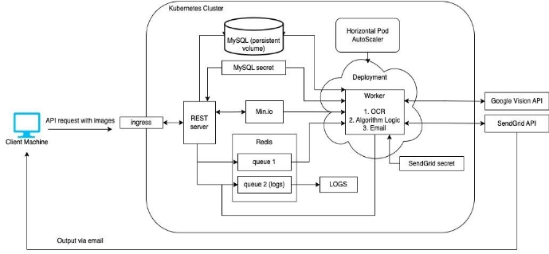
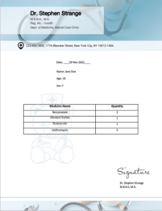

**FINAL PROJECT REPORT** 

**CSCI 5253: DATACENTER SCALE COMPUTING FALL 2022** 

**PROJECT TITLE** 

The Drug Dealer - An Electronic Assistant for Prescription Drugs 

**TEAM** 

Divya Pragadaraju, Mukund Kalantri, Medha Rudra 

**PROJECT OVERVIEW & GOALS** 

Hopping from store to store, looking for prescribed medicines is not the ideal activity any patient or their caretakers would want to go through. It is tedious and draining. We propose a project idea that aims to resolve this problem and makes people’s lives easier, in an efficient way. 

The goal of our project is to provide a distributed and scalable service that eases the process of buying necessary medicines so that consumers don’t have to make several trips to different stores to check the availability of medicines. A patient is required to upload their prescription and we would extract its contents using an OCR API in the form of a list of prescribed medicines. Subsequently, we search our Database which contains the inventory details of Pharmacies and return as a result, the availability of the required medicines along with the details of the optimal number of pharmacies that the patient needs to visit to get all the medicines. Thus, we could accomplish our goal for this project. 

As an extended goal, for future work, we would like to optimize our algorithm based on the pharmacies nearest to the consumer. 

**COMPONENTS** 

For this project we are making use of the following software components: 

1. Google Cloud Vision API 
1. REST API 
1. Kubernetes 
1. MySQL 
1. Min.io 
1. Redis  
1. SendGrid API 

**ARCHITECTURAL DIAGRAM** 

**COMPONENT INTERACTION** 

We implemented this application using APIs, where we send the receipt of medicines as an attachment in the request. When we hit the REST API, it uses the exposed port through ingress to send the client request to the server. The logic in the REST server will generate a hash value corresponding to the prescription image and upload the image to the Min.io bucket. The hash value would then be added to the queue maintained in Redis. The logging queue would be continuously read by a pod which will print the logs to the terminal, thus helping us in debugging.  

We have also implemented a Worker that would first pull the image to be processed from the Min.io bucket. The retrieved image is converted to text using Google’s Vision API that does OCR on the image and extracts the medicine names. Once that is done, we connect to MySQL which stores the inventory of medicines maintained by a bunch of pharmacies along with the shop’s metadata (like location coordinates). We then apply our algorithm on the text data to find the minimum number of pharmacies a patient needs to visit to get all their prescribed medicines. This list is the output of this function which would be passed to logs and emailed as a response to the client via email using the SendGrid API. 

**DEBUGGING & TESTING** 

We tested the REST Server by running the flask application on a local system to test API requests and flask endpoints. For MySQL queries, we did testing of our queries in a local system using SQLite and Jupiter environment. We also checked the queries and connections within the cluster by SSHing into the MySQL container. Testing for the Worker was mostly done by SSHing into the container  and  running  the  required  commands  there.  We  used  logs  in  our  application  for debugging by logging information of each important operation in every function. Redis and Min.io were tested by port-forwarding the service to localhost, as well as with the use of logs. For Google Vision API and SendGrid API, we implemented and tested the code on a local system, verified the working of the implementation, and then copied that code into the containers**.** 

**WORKING** 

To start with, we first created all the pods and Kubernetes resources required for the project implementation and then created and populated a MySQL Database through the REST Server with medicine and pharmacy data. 

Figure 1: Sample Request Image (Prescription) 

The client request should contain the image of the prescription and their email which is sent to the REST Server through the port exposed using ingress. When the REST Server receives this request, it extracts the data and creates a local image file, and the image is uploaded to a Min.io bucket. We generate a hash value corresponding to this image and add it to the Redis worker queue and remove the local image file. The worker container picks the message from the Redis queue and extracts the filename and email, then using the filename extracts the image file from the Min.io bucket. We then use the Google Vision API to extract all text from the image which is then filtered to get the required data like the medicines and their quantity. Using this data, information regarding the availability of medicines in various pharmacies is extracted by querying the MySQL Database. Our algorithm finds the minimum number of pharmacies that have a stock of the required medicines and uses the SendGrid service to send an email containing the output, which is the details of the pharmacies, back to the client.  

We used horizontal pod autoscaling on our worker deployment, which basically does all the work. This gives our service to scale up or down automatically based on the server load. We set our pods with very low CPU and memory resources to test this and specified a maximum of 4 pods for the autoscaler. When we tried to give it 100+ requests at once, the autoscaler created new pods as required based on the load and once the load was reduced, the pods got deleted automatically. We think that with good resources set to our deployment, this service would be able to handle a significant load at the same time. We also learned how to use Kubernetes Secrets which provides a safe way to manage any sensitive data. For our application, we're using this for securely storing our MySQL database password and the SendGrid API key. 

For future work, this application could be enhanced to use a patient’s location to shortlist medical stores around a certain radius. This would give more accurate and relevant output. The price of medicines across different stores varies, and with a more sophisticated algorithm in place, we could find medicines in the shops closest which also provide medicines at a lower total cost. 

**REFERENCES** 

1. https://codelabs.developers.google.com/codelabs/cloud-vision-api-python#0 
1. https://nanonets.com/blog/google-cloud-vision/ 
1. https://learning.oreilly.com/library/view/designing-data-intensive- applications/9781491903063/ch02.html#idm45085118969056
1. https://costplusdrugs.com/medications/
1. https://spacelift.io/blog/kubernetes-secrets 
1. https://worthstart.com/pharmacy-names/
1. https://www.kdnuggets.com/2021/02/deploy-flask-api-kubernetes-connect-micro- services.html 
